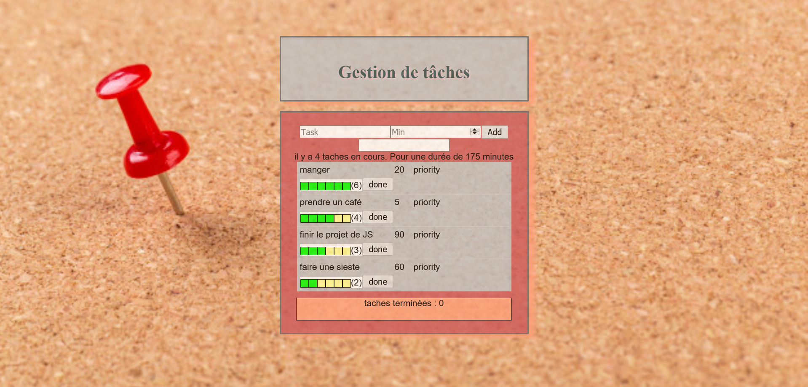

# **Projet React**

## **Authors**
* FATHALLAH Mohamed-Amine
* FRIK Elias
* ERNEST Julien 
* AHMED SALEM Mouhemd-El-Hassene 

## **Présentation** 
_L'application à réaliser permet la gestion de tâches définies par une durée et auxquelles il est possible d'attribuer une priorité. On distingue les tâches à réaliser de celles déjà terminées._

<p align="center" scale= "50 %">
  
</p>

## **Installation de l'application** 

-  Pour cloner le dossier, tapez commande suivante :
 ```
  git clone https://gitlab-etu.fil.univ-lille1.fr/fathallah/fathallah-frik-ernest-ahmedsalem-js.git
 ```
- Si vous souhaitez acéder à l'application à travers le clone avec SSH, tapez la commande suivante :
 ```
  git clone git@gitlab-etu.fil.univ-lille1.fr:fathallah/fathallah-frik-ernest-ahmedsalem-js.git
 ```
- Placez vous dans la racine du projet react-task et tapez ces deux  commandes :
 ```
  npm install
 ```

 ```
  npm run build
 ```

## **Accée à l'application**

Placez vous dans la racine du projet react-task, et tapez la commande suivante:
  ```
  npm run dev-server
  ```
 

## **Guide de l'application**
Pour bien utiliser l'application, voici quelques points qui vont vous aider:
- Ecriver la tache que vous voulez ajouter ainsi que le temps et selectionner le bouton add pour l'ajouter.
- Choisir les priorités de 1 a 6 et elles seront classés par ordre decroissant.
- Utilisr le filtre pour rechercher les taches.
- Une fois appuyer sur le bouton done,les éléments disparaissent de la liste et le nombre des taches terminées   s'incrémente.
